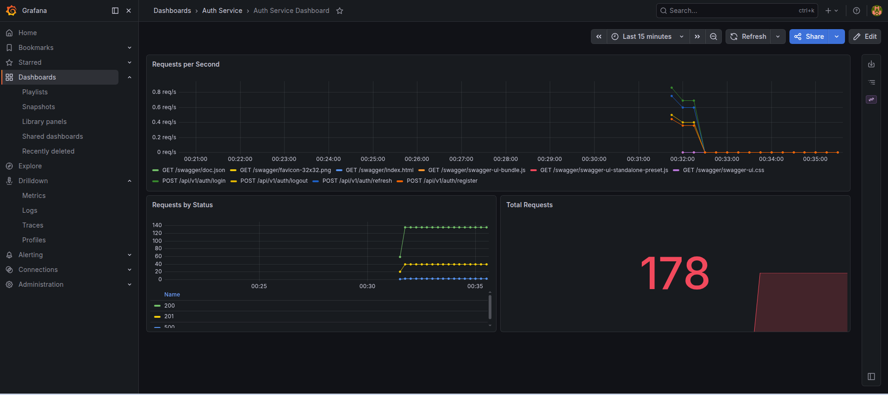
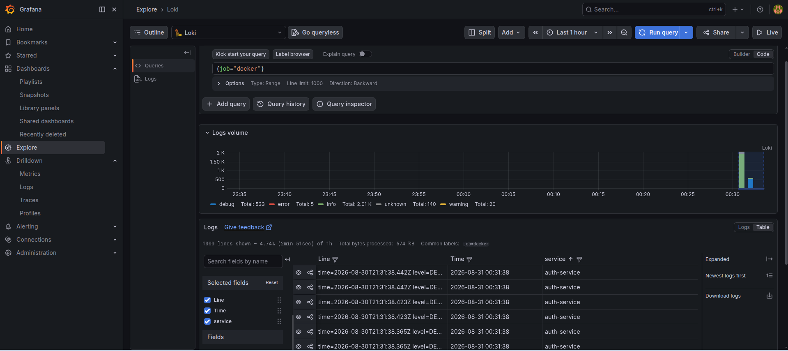
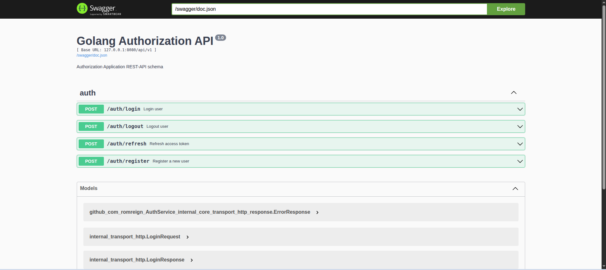

# AuthService
Микросервис аутентификации, реализующий единый источник для идентификации пользователей и выдачи токенов.

## Ключевые особенности
- Stateless‑подход с короткими access‑токенами и серверными refresh‑токенами
- Поддержка ротации refresh‑токенов; 
- Готовность к горизонтальному масштабированию в Kubernetes.

## Аудитория
Web‑приложения, мобильные клиенты, внутренние API‑сервисы

## Переменные окружения
Пример переменные окружения находятся в файле .env.example. Для запуска нужен файл .env содержащий все переменные из .env.example.

## Быстрый запуск микросервиса через docker-compose 
Перед выполнением команд .env.example замените на .env
```bash 
    make env-up
    make migrate-up
    make auth-up-b
```
Быстрые curl тесты (осторожно, данные попадают в бд, собираются метрики). Можно выполнять сколько угодно раз.
```bash
    make bash-test
```
Unit тесты service слоя с mock зависимостями
```bash
    make auth-test
```

## REST API endpoints
|      Endpoint         | Method |          Description           |
|-----------------------|--------|--------------------------------|
| /api/v1/auth/register | POST   | регистрация пользователя       |   
| /api/v1/auth/login    | POST   | аутентификация пользователя    |    
| /api/v1/auth/refresh  | POST   | получение нового access токена |
| /api/v1/auth/logout   | POST   | завершить сеанс пользователя   |  

## Метрики
- GUI Grafana доступен на localhost:3000
- GUI Prometheus доступен на localhost:9090
- Приложение отображает в Grafana на dashbourd следующие метрики: rps, total request, request by status.



## Логирование
- Логи приложения доступны в Grafana Loki: Grafana -> Explore -> Источник:Loki -> Код {job="docker"}
- Сбор логов осущетсвляется с помощью агента alloy из всех docker контейнеров.



## Swagger 
Swagger doc доступен на localhost:8080/swagger


## Используемые технологии
- Go (основной язык программирования)
- PostgreSQL (основная база данных)
- Redis (кеширование для idempotency)
- Docker (контейнеризация приложения)
- Make (автоматизация сборки)
- Bash (скриптовые мини curl тесты)
- Prometheus (метрики)
- Grafana (dashbourd метрик)
- Loki (логи)
